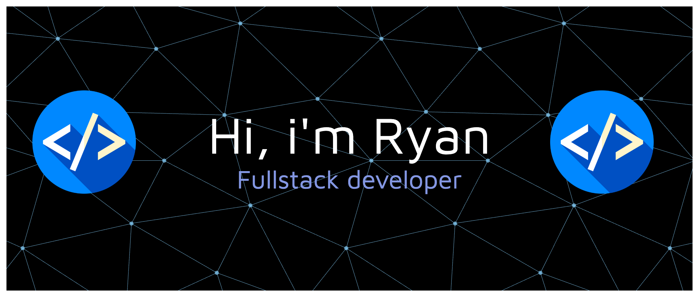

## Hi there 👋

 

**Software engineer** based in **London, UK**  
Currently enrolled in the **[Makers Academy](https://makers.tech/) 16-week intensive software engineering bootcamp**, building full-stack applications using modern technologies and industry-standard engineering practices

---

## 🛠 Tech stack 

### Languages

### Backend

### Frontend

### Databases

### Testing & Tools

---

## 🚀 Currently
- Working on portfolio projects with **React + Flask**
- Focusing on **testing, API design, and performance**
- Occasionally getting lost in a promise
